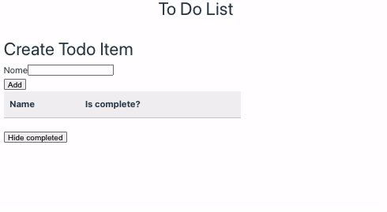

# ToDoList
 

    <h3>Back End</h3>
    

        <strong>Web Api C#</strong>
        <ol>
            <li>JSON persistence using System.Text.Json</li>
            <li>Serilog</li>
        </ol>
    

    <h3>Front End</h3>
    

        <strong>Vue3</strong>
        <ol>
            <li>Typescript</li>
            <li>Pinia</li>
            <li>Axios</li>
        </ol>
    

    <h3>Project:</h3>
    

Feel free to further improve the project on your own.

<i>Note: English is not my first language</i>

